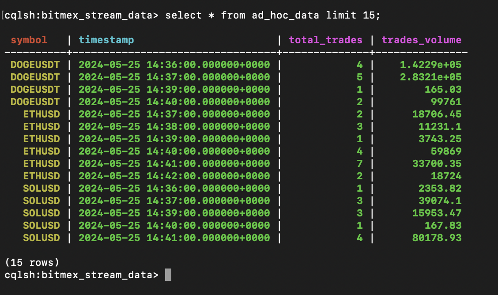
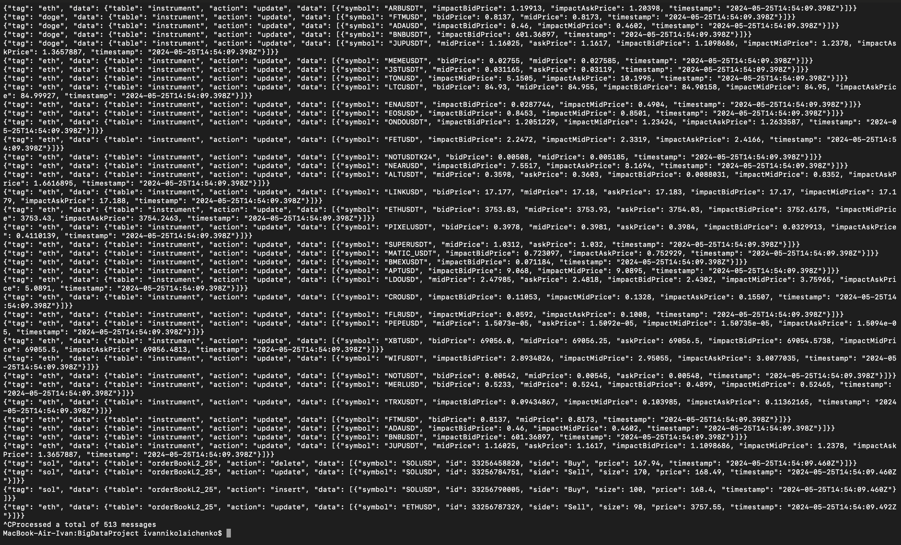
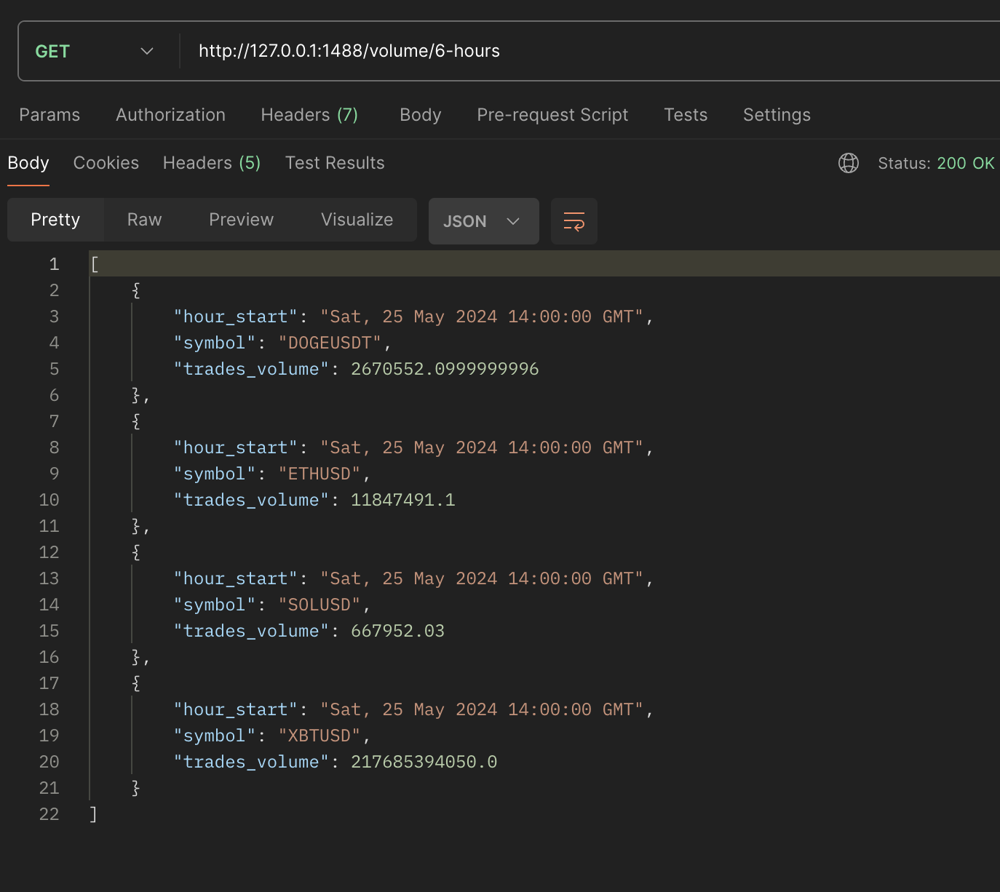
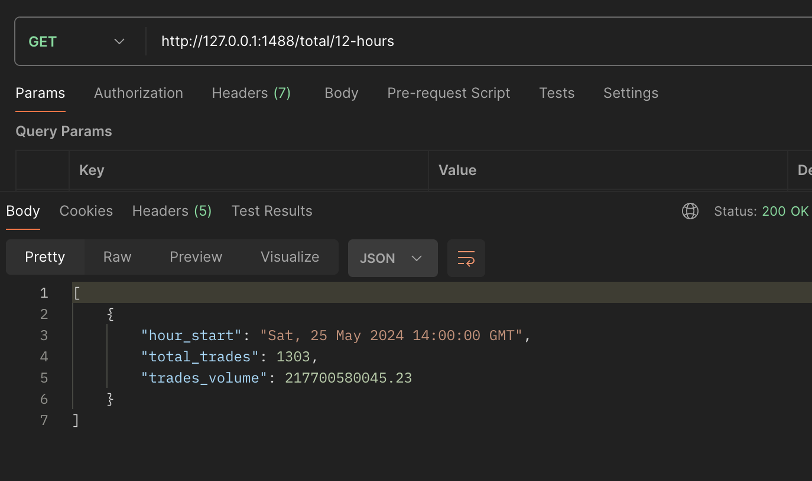
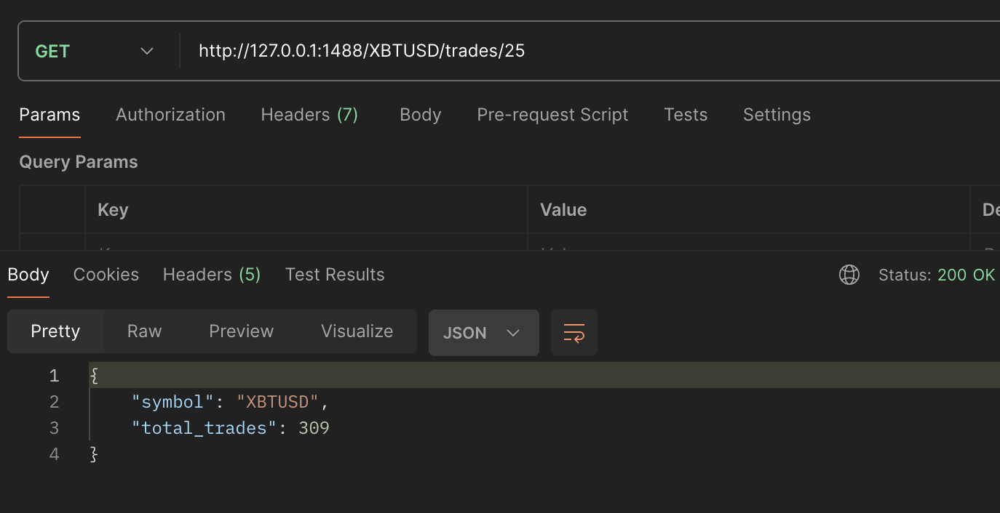
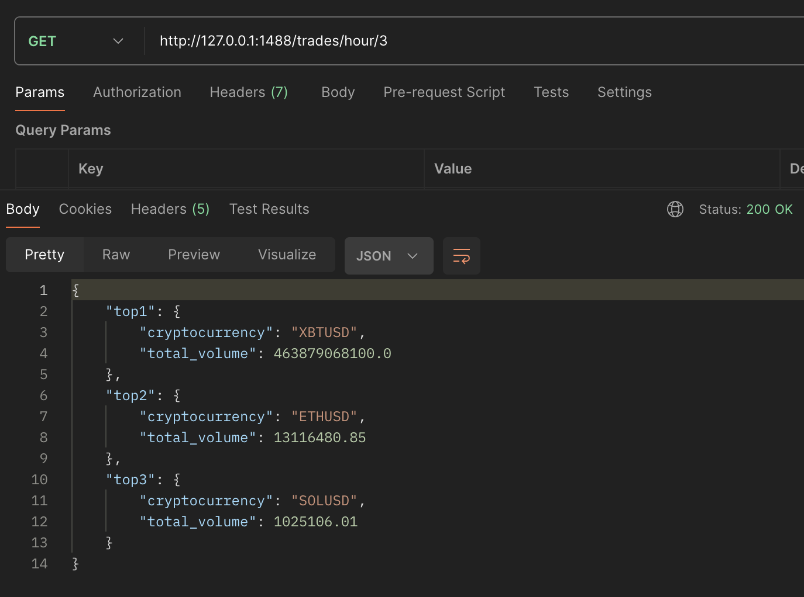
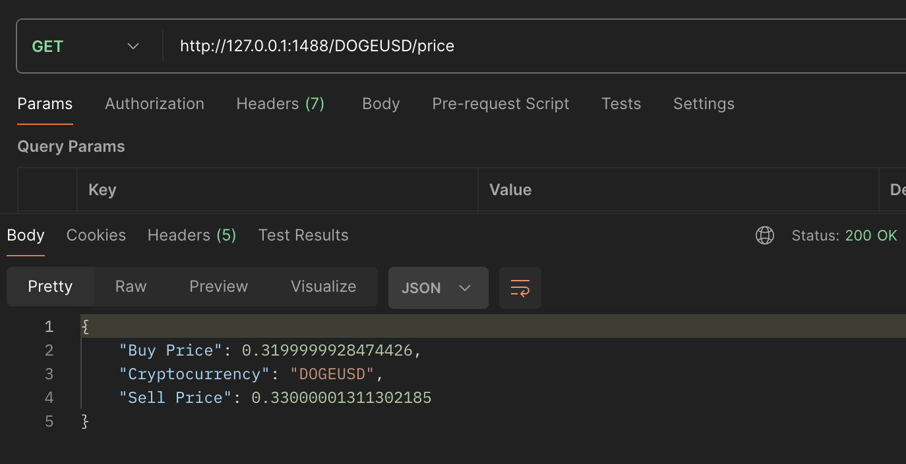

# BigDataProject

Authors: 
- **Liubomyr Mokrytskyi**
- **Ivan Nickolaichenko**

## 📝 Description

_In this project our goal was to get stream data from crypto exchange BitMEX using websocket, transform and filter those data using Apache Spark Stream and save into the Cassandra Database, so after user can using API Gateway get summarized information about cryptocurrencies from it._

## System Design

**BitMEX** - криптобіржа, з котрої за допомогою Web Socket, ми будемо будувати потік постійних даних, про певні криптовалюти, аби потім їх обробляти та показувати користувачі певну статистику по ній.

**USER** - це користувач застосунку, який може надсилати запити до API GATEWAY, аби отримати корисну інформацію про ситуацію, яка відбувається на крипто-біржі BitMEX з деякими монетами, які були вибрані заздалегідь наперед. 

**Attention!**
Для даного проекту ми обрали 4 криптовалюти, які будуть оброблятись обов’язковими ендпоінтами, котрі були згадані в умові завдань - XBTUSD, ETHUSD, SOLUSD, DOGEUSD.

**API GATEWAY** - приймає усі запити, котрі користувач надсилає даному сервісу, надсилає їх на обробку, а після того, як буде оброблений запит, надсилає назад відповідь користувачу. Тобто по факту це частина системи, у якій відбувається вся комунікація (requests і responses).

**Crypto Service** - опісля того, як запит надійшов до API GATEWAY, він “каже”, що потрібно повернути користувачу і даний сервіс за допомогою підготовлених queries робить звернення до бази даних StreamDatabase, яка містить усю інформацію з потоку даних біржі, та дістає усюінформацію, яка є необхідною. Реалізовано з допомогою веб-сервера та REST API. 

**StreamDatabase** - NoSQL база даних, яка зберігає профільтровані, оброблені (трансформовані) дані, які надходять з потоку біржі BitMEX, про визначені криптовалюти, наприклад їхні sell/buy ціни, об’єм торгівлі за певний період часу і тд. Ми використовували Apache Cassandra, оскільки кількість даних, яка буде надходити до системи є надзвичайно великою, її потрібно ефективно обробляти та в подальшому швидко читати, а як ми знаємо це і є основними перевагами Cassandra.

**DataETL** - сервіс, який відповідає за ETL процес та складається з наступних компонентів:

- **Web socket** - це початок першого етапу - Extraction. Аби кожен раз, аби отримати якусь інформацію про певну криптовалюту, не робити новий request запит до нашої крипто-біржі BitMex, ми робимо певний connection з нею, та безперестанку отримуємо ці дані, як потік. Реалізовано за допомогою WebSocket.
- **Queue** - оскільки дані можуть надходити в систему з різними інтервалами і кількістю, нам потрібно зробити цей потік зручним для обробки, тобто стабільним, тому ми хочемо чітко вишикувати кожну одиницю даних, аби не виникало проблем при її обробці. Реалізовано за допомогою Apache Kafka.
- **Transform/Load** - наступні етапи ETL процесу, які читають інформацію з черги повідомлень Apache Kafka та виконують необхідну фільтрацію (наприклад обирає тільки трейди) та трансформацію (рахує загальний volume для певної криптовалюти протягом години) даних. Після чого зберігає їх у відповідні таблички в базі даних Cassandra. Реалізовано за допомогою Apache Spark Streaming.

## 🖥 Files

The result of this homework is:

- [commands.txt](commands.txt) - file that will help you, as a new user to quickly copy all necessary commands in the correct order. 
- [Photos](Photoes) - folder that contains all screenshots of application work results and photos for system design.
- [Design.drawio](Design.drawio) - file where the design of the system is stored
- [docker-compose.yaml](docker-compose.yaml) - file that will help you to create all necessary containers of helper services as cassandra, spark etc.
- [DataExtraction](DataExtraction) - folder in which files for ETL are stored.
    - [ddl.cql](DataExtraction/ddl.cql) - file that contains all necessary DDL queries for Cassandra database the project is needed.
    - [requirements.txt](DataExtraction/requirements.txt) - file with necessary Python libraries for the DataETL container
    - [create_tables.sh](DataExtraction/create_tables.sh) - bash file to create tables in cassandra
    - [socket_connect.py](DataExtraction/socket_connect.py) - Python file with web socket and loading data into the Apache Kafka queue.
    - [transform_1.py](DataExtraction/transform_1.py) - Python file to transform and filter data from the queue using Apache Spark Streaming and saving into the Cassandra database.
    - [Dockerfile](DataExtraction/Dockerfile) - Dockerfile using which you can create and start a container for ETL process. 
- [RestAPI](RestAPI) - folder in which files for REST API are stored:
    - [requirements_api.txt](RestAPI/requirements_api.txt) - file with necessary Python libraries for the REST API container
    - [start_api.sh](RestAPI/start_api.sh) - bash file to build REST API container
    - [kill_api.sh](RestAPI/kill_api.sh) - bash file to stop and delete REST API container
    - MVC - files:
      - [controller.py](RestAPI/controller.py) - flask app controller
      - [service.py](RestAPI/service.py)
      - [repository.py](RestAPI/repository.py)
    - [Dockerfile.api](RestAPI/Dockerfile.api) - Dockerfile using which you can create and start a container for REST API. 

## 🖥 Usage

### How to run scripts

🔻 **EXAMPLE BELOW** 🔻

1. Clone the repository
2. Open powershell terminal
3. Enter the repository using the path to its local directory on your computer
4. Run next command: `docker-compose build` - to load and build Docker Images, create network
5. Run next command: `docker-compose up -d` - start installation in detached mode.
6. Run next command: `.\DataExtraction\create_tables.sh` - to create tables in the Cassandra Database
7. Make sure to run the insert queries from the `commands.txt` file
7. Open new terminal and run:
    - Run next command to create a container of spark-submit: `docker run --rm -it --network project-net --name spark-submit -v .:/opt/app bitnami/spark:3 /bin/bash`
    - Run next command to change directory for needed one: `cd /opt/app`
    - Run next command to start : `spark-submit --conf spark.jars.ivy=/opt/app --packages "org.apache.spark:spark-sql-kafka-0-10_2.12:3.2.0,com.datastax.spark:spark-cassandra-connector_2.12:3.0.0" --master spark://spark:7077 --deploy-mode client --executor-memory 1G --total-executor-cores 2 transform_1.py`
8. Run next command: `.\RestAPI\start_api.sh` - to build and start REST API container 
9. Now you can use all endpoints from Results section to test how our application works or using commands from [commands.txt](commands.txt) to "look into" the containers of the Apache Kafka queue or Cassandra database 
10. Write `exit` - to shut down temporary container or `CTRL + C` - to shut down temporary kafka or REST API in all terminals. 
11. Run next command: `.\RestAPI\start_api.sh` - to stop and delete REST API container 
12. Run next command: `docker-compose down` - to shut down the installation.

### Results

🔻 **Screenshots**  🔻
- Data in cassandra tables (intermediate)

- Kafka Consumer which is used by spark

### Endpoints

##### Precomputed:
1) Return the aggregated statistics containing the number of transactions for each cryptocurrency for each hour in the last 6 hours, excluding the previous hour. 
<b>Endpoint:</b> `http://127.0.0.1:1488/transactions/6-hours`

2) Return the statistics about the total trading volume for each cryptocurrency for the last 6 hours, excluding the previous hour. 
<b>Endpoint:</b> `http://127.0.0.1:1488/volume/6-hours`

3) Return aggregated statistics containing the number of trades and their total volume for each hour in the last 12 hours, excluding the current hour.  
<b>Endpoint:</b> `http://127.0.0.1:1488/total/12-hours`

##### Ad_Hoc:
1) Return the number of trades processed in a specific cryptocurrency in the last N minutes, excluding the last minute. 
<b>Endpoint:</b> `http://127.0.0.1:1488/ETHUSD/trades/25`

2) Return the top N cryptocurrencies with the highest trading volume in the last hour. 
<b>Endpoint:</b> `http://127.0.0.1:1488/trades/hour/3`
 
3) Return the cryptocurrency’s current price for «Buy» and «Sell» sides based on its symbol.  
<b>Endpoint:</b> `http://127.0.0.1:1488/DOGEUSD/price`

## 📌 Nota bene

1) We recommend you to use [commands.txt](commands.txt) to copy all commands, it will be a lot easier.
2) Also, the data for table `currency_price_data` is artificial, since nor os our computer were able to process writing to three tables at the same time. The code for transforming the data for this third table is commented, but you can still check it out. It works if writing process to other tables is disabled. 
3) We ran our code for 1.5 hour only before doing the screenshots. That is due to containers memory bound. I put the max value (8gb) in docker settings, but still, if run more than 1.5 hours, spark stops and cassandra container dies immediately with all written data inside.